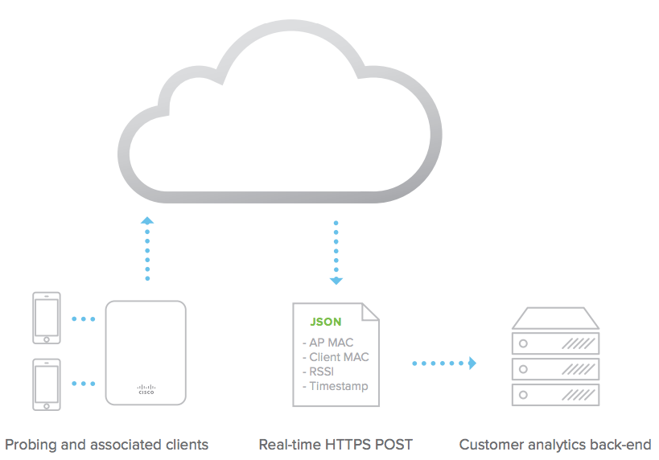

# Scanning APIx.3
Thanks to widely available ‘smart devices equipped with WiFi and BLE, Cisco Meraki’s wireless access points can detect and provide location analytics to report on user foot traffic behavior. This can be especially useful in multi-site retail or enterprise deployments where admins or departments beyond IT wish to learn more about trends and user engagement. Coupled with traditional reporting from the WiFi network on client devices, applications and websites, Cisco Meraki provides a holistic view of online and offline user traffic.  

Leveraging our globally distributed datacenter architecture, Cisco Meraki has built an end-to-end system that can aggregate data from thousands of endpoints for effective collection, analysis, and presentation of this data on the Meraki Dashboard. Comparisons can be run between different sites and time periods, and Cisco Meraki’s network tagging functionality allows for an unlimited variation of comparisons by creating batches of networks that can be grouped together based on district, region, or any other preference. In addition to the built-in location analytics view, the Scanning API enables Cisco Meraki customers to detect and aggregate real-time data for custom applications.

The Scanning API delivers data in real-time from the Meraki cloud and can be used to detect WiFi (associated and non-associated) and Bluetooth Low Energy (BLE) devices in real-time. The elements are exported via an HTTP POST of JSON data to a specified destination server. The raw data is aggregated from all access points within a network on the Meraki cloud, and sent directly from the cloud to an organization’s data warehouse or business intelligence center. The JSON posts occur frequently, typically batched every minute for each AP.

Using the physical placement of the access points from the Map & Floorplan on the Dashboard, the Meraki cloud estimates the location of the client. The geo-location coordinates (latitude, longitude) and X,Y location data accuracy can vary based on a number of factors and should be considered a best effort estimate. AP placement, environmental conditions, and client device orientation can influence X,Y estimation; experimentation can help improve the accuracy of results or determine a maximum acceptable uncertainty for data points.
